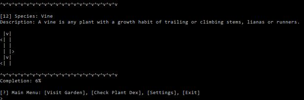

# 🌺 Garden
```
  .-_'''-.      ____    .-------.     ______         .-''-.  ,---.   .--.
 '_( )_   \   .'  __ '. |  _ _   \   |    _ '''.   .'_ _   \ |    \  |  |
|(_ o _)|  ' /   '  \  \| ( ' )  |   | _ | ) _  \ / ( ' )   '|  ,  \ |  |
. (_,_)/___| |___|  /  ||(_ o _) /   |( ''_'  ) |. (_ o _)  ||  |\_ \|  |
|  |  .-----.   _.-'   || (_,_).' __ | . (_) '. ||  (_,_)___||  _( )_\  |
'  \  '-   .'.'   _    ||  |\ \  |  ||(_    ._) ''  \   .---.| (_ o _)  |
 \  '-''   | |  _( )_  ||  | \ ''   /|  (_.\.' /  \  '-'    /|  (_,_)\  |
  \        / \ (_ o _) /|  |  \    / |       .'    \       / |  |    |  |
   ''-...-'   '.(_,_).' ''-'   ''-'  '-----''       ''-..-'  '--'    '--'
```
> Simulated gardening game written in Go

## ☁ Download
You can download the latest version of this game [here](dist/).

## 🎮 Gameplay Features

### 🌱 Growing Plants
In order to grow your plants, visit your desired plant and water it. When you water it, it will grow one level at a time.

### ☘ Obtaining New Plants
In order to obtain new plants, you must choose a plant that has a level higher than 3 and trim it. When you trim your plant, there is a chance that a random seed may drop.

### 🏁 Goal
Your goal to complete Garden is to fill up your plant dex with 💯% of all the available plants in the game.

### 📷 Screenshots
> __Splash Screen__


> __Checking the Plant Dex__


> __Harvesting Seeds__


> __Visiting Plants__


